# handwritting-input-system

## How to run

To run the program, make sure you have configured the following environment on your computer:

1. Install Xcode (v8.0 or above) on your Macbook. (Install Visual Studio is theoretically feasible, but may encounter other problems.)
2. Configure OpenCV environment on your laptop (our version is v3.1.0).
3. Plug in two usb cameras.
4. Open "Writing_Recog_System.xcodeproj" in Xcode.
5. You may configure "VideoCapture" parameter in main.cpp file (line 38-39)to enable our program to identify your cameras.
6. Place two cameras at the right position. One on top of your hand with appropriate distance and other on the left edge of your desk.
7. Run the project in Xcode and enjoy the innovated writing experience.

## Program Structure
The overall design of our program is illustrated below:

    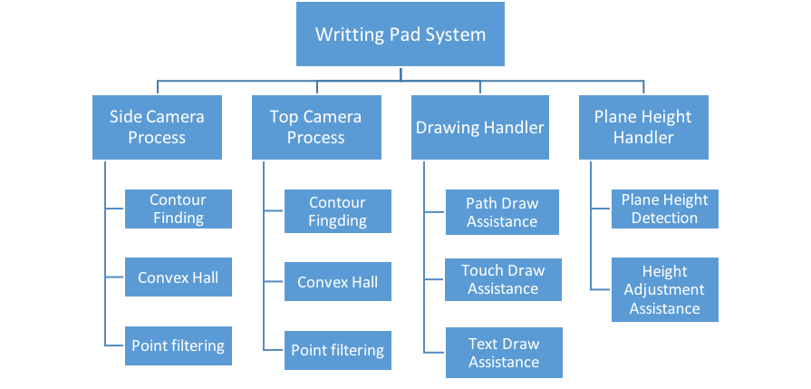

## Initiative and Design
The design idea of this system can be generally divided into two parts. In the first part we mainly consider those methods that can be used to trace the fingertip of a hand for the top camera. The second part focuses on figuring out a set of algorithms that serve to detect the finger touching result for the side camera. The functions to be implementing for these two parts are illustrated in details below:

### The first part
- Detect and trace the position of fingertip of the “longest” finger, that is, the fingertip with the highest position along y axis.
- Record the fingertip position for each frame and translate this set of points as drawing path.
- Be able to detect and drop “unrealistic” drawing points – the kind of points with an unrealistic position in a frame given the position of previous drawing points (usually caused by fingertip detection failure).

### The second part
- Detect and trace the position of fingertip of the “lowest” finger, that is, the fingertip with the lowest position along y axis.
- Automatically detect the height of plane so as to determine the touching threshold as well as guide user to place side camera on the correct level.
- Detect the touching state of finger. If a touching event is detected, informing drawing function to draw path on the canvas. If the touching event terminates, informing drawing function to stop drawing path.

## Method and Implementation
In our project, we need to implement (or call from OpenCV library) a series of image processing method so as to extract useful and meaning information from the original scene images captured by the camera system. In order to segment the target object (In our case, hand and fingertip) from the background, We made reference to some relevant papers and finally came up with a set of methods that, when combined into a specific order, can yield acceptable results.

For a quick look at the methods we adopted, we list them below (sorted by their actual order of applications):

Methods applying to fingertip detection:
- Skin color detection
- Median blur (Median filter)
- Dilation
- Contour finding
- Convex hull
- Target point reducing
- Target point filtering

Methods applying to plane height detection:
- Detect Region of Interest
- HSV Color Conversion
- Histogram Calculation
- Back projection
- Filter2D
- Contours Finding
- Extract the Largest Contour
- Draw contour and bounding box

For each aforementioned method, we will elaborate in the following part the function it serves and the purpose we introduce it into our program.

### Skin color detection
The general purpose this method is serving as is to identify objects in the scene image with skin color and extract them into a processed image. This is no doubt one of the most widely used methods (before the pervasion of CNN) when the target object is the part of human body.

There already existed a bulk of research conducted by scientists from various field with regards to figuring out a most accurate way to identify skin color from background and reduce the rate of misclassification. Based on our own experiment, the skin color can by more accurately extracted if we can take advantage of the color information captured by our camera system to a larger extent. After repetitive experiments, we finally decided to adopt the algorithm proposed by Nusirwan Anwar[1] which takes RGB, HCbCr and HSV into consideration.

In addition to the most popular mentioned RGB color model, some color spaces have their luminance component separated from the chromatic component, and they are known to possess higher discriminability between skin pixels and non-skin pixels over various illumination conditions. HCbCr and HSV are models of such kind. Figure2 and Figure3 shown below are images in HSV and HCbCr color mode converting from the primitive RGB image Figure1.

    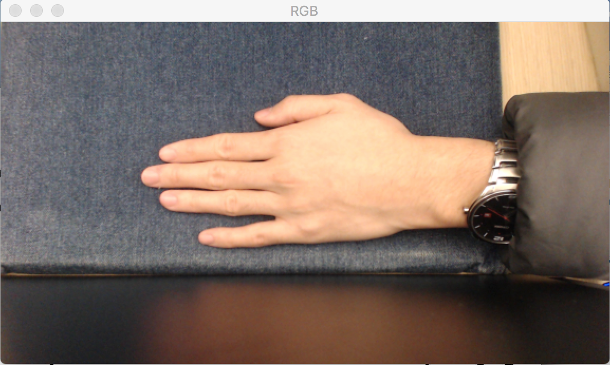
    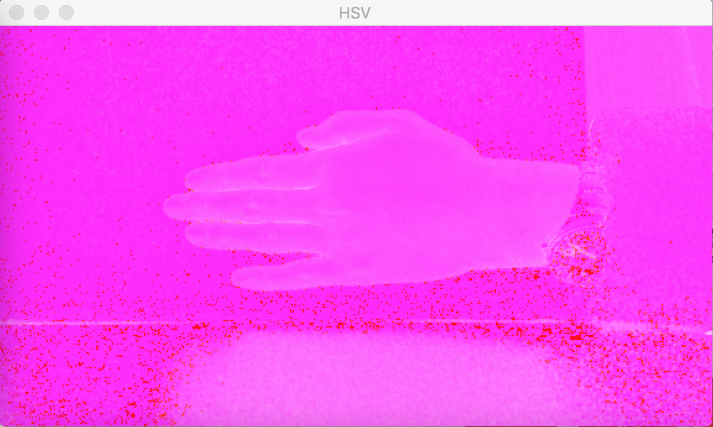
    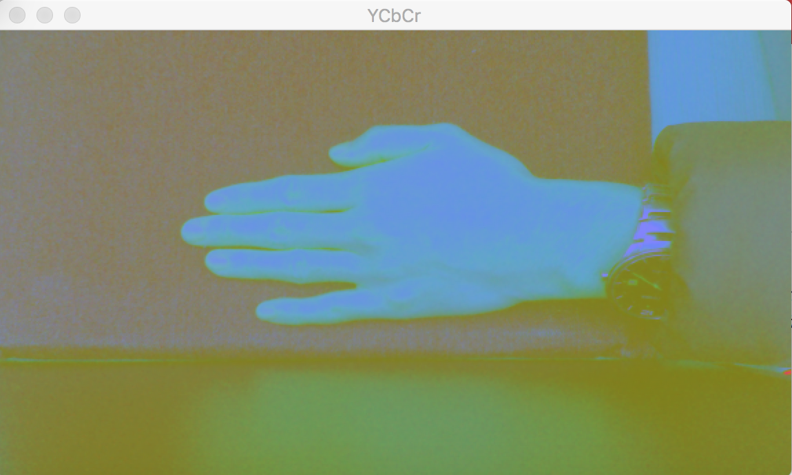

To make a long story short, we exerted the following contraints (color filters) to identify skin color pixels from the original RGB image by converting, if necessary, the primitive input into HCbCr and HSV color model separately.

A sample output of this step:

    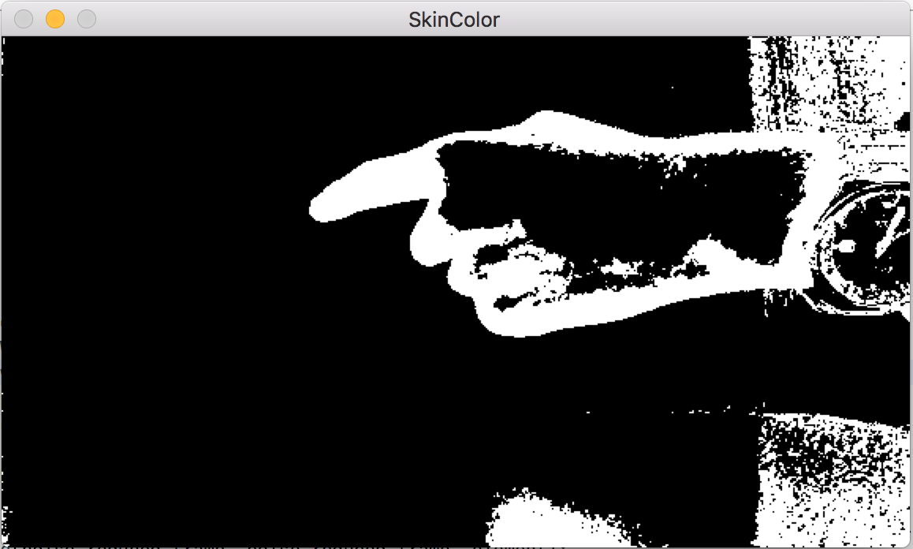

### Median blur (Median filter)
Median blur is a famous algorithm that works well in eliminating white noise (such as salt and pepper noise) from the original image. The main idea of the algorithm is to move a kernel on the image pixel by pixel and replace the central element (pixel) of the overlapped kernel with the median of all the pixels within the kernel.

Since the results output by previous step are prone to carry with some disordered noise, we can effectively kill these stuffs by introducing this algorithm.

A sample output of this step:

    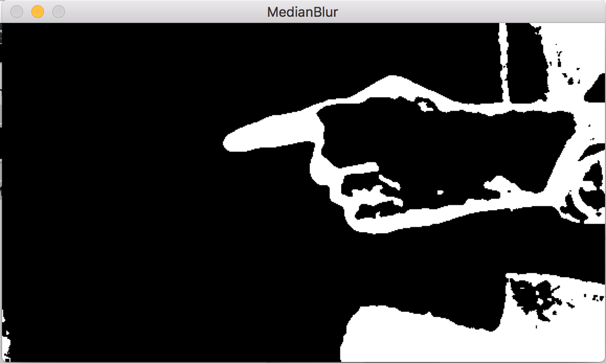

### Dilation
Dilation is a common method to apply when we are willing to “dilate” the white region in an image. This method operates by convoluting an image with a special kernel. When this kernel is scanned over an image, the central pixel of the overlapping region on the image is replaced with the maximal value of pixels within the overlapping region.

We are now able conclude that this operation can cause the bright region within an image to “grow”, which is exactly the feature we are looking for, since there still exists many inconsecutive set of points in Figures. Our desirable result is an image with hand region labelled continuously and smoothly.

A sample output of this step:

    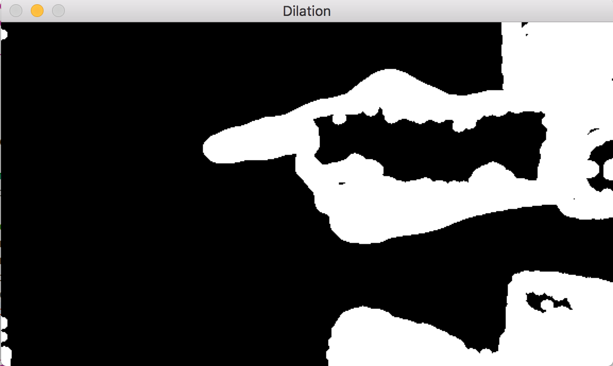

### Contour finding
The next step is to find the contour of each white region in Figure6 separately. Although we have implemented our own contour finding method based on the boundary following algorithm, we finally resort to OpenCV library due to the inferior performance our algorithm.

Note here that we may possibly find out many contours from Figure6 since the misclassified regions generated by skin detection algorithm still exist. Hence, we need to filter these regions out by only processing the region with the largest area in the subsequent step and simply ignore those smaller regions.

A sample output of this step:

    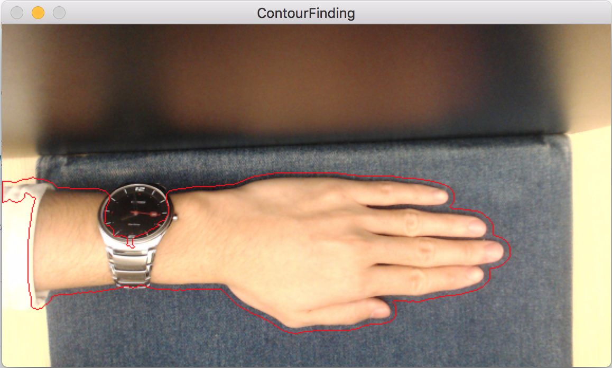

### Convex hall
In mathematics, Convex Hull is the smallest convex set that contains a set of points. And a convex set is a set of points such that, if we trace a straight line from any pair of points in the set, that line must be also be inside the region.

In computer vision field, we usually draw a convex hall of a complicated shape so that we can process and analyze this object in a much more convenient way. In our own case, introducing this method can help us simplify the extraction of the fingertips from a hand shape.

Again we invoke OpenCV “convexHall” function to help us achieve this goal. The result of this method is an array (vector) of points that denote the “corners” of the convex hall polygon. These “corner” positions are super useful in determining the fingertip position according to their distribution along the boundary of the polygon.

A sample output of this step:

    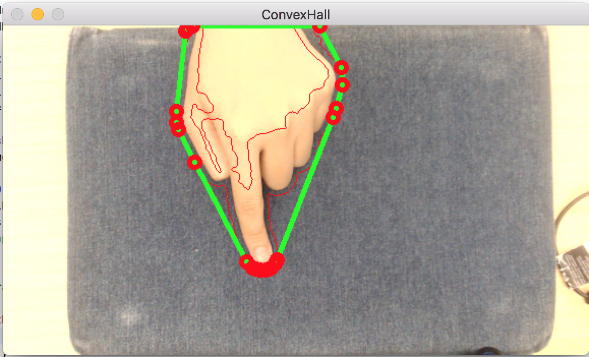

### Target point reducing
The reason why we deem the “corner” points of convex hall as “super meaningful” is that these points most possibly occur in the fingertip region of our hands since our fingertips always possess a certain curvature [2]. Besides, this curvature is usually biggest in comparison with other parts of our hand.

Since openCV does not actually save the position of a convex hall but save instead the “corner” points of this polygon. It is easy for us to deduce that a boundary with higher curvature should be described by more “corner” points. This feature carves out a way for us to figure out the position of fingertip without much effort. Thus, we need to apply certain methods to this set of points to extract our desired point properly.

The first thing we should do is to reduce the number of points in figure8. It is not hard for us to conclude from figure8 that points are likely to congregate in the part of convex hall with curvature information. Therefore, we should reduce those points in a swarm to a single point, representing a small targeting region of the whole image.

The specific implementation of this method is to classify points on the convex hall based on their relative distance. Then we pick only one point from each class to form a set of points with much less size.

A sample output of this step:

    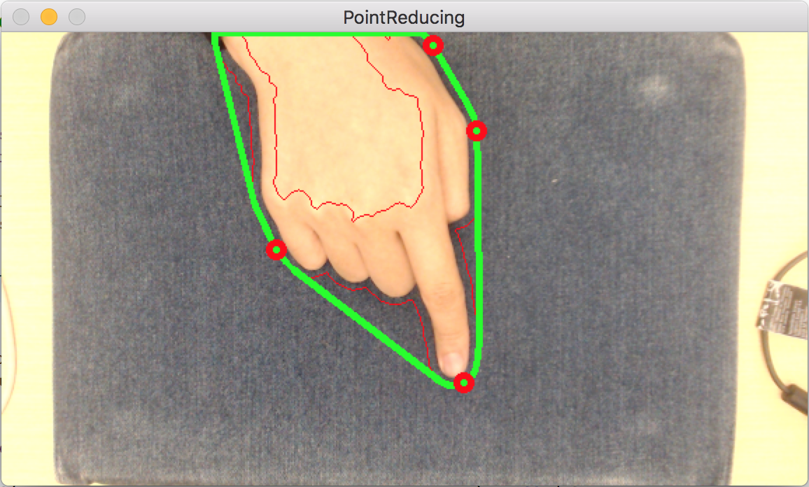

### Target point filtering
In this part we are still seeking for the target point that could most possibly indicate the position of our fingertip. Hence, we proceed our filtering step by exerting more constraints on it. These extra constrains are listed below:

- Only consider the point of which the angle between itself and the center of contour region to be between a certain interval (50-130).
- Only consider the point of which the height from the center of contour region to be between a certain interval (around half of the height of the contour bounding box).

By exerting these two extra constraints on the set of points. We can finally obtain a single point which represents the position of fingertip with theoretically highest possibility.

Pictures below illustrate these two constraints better:

    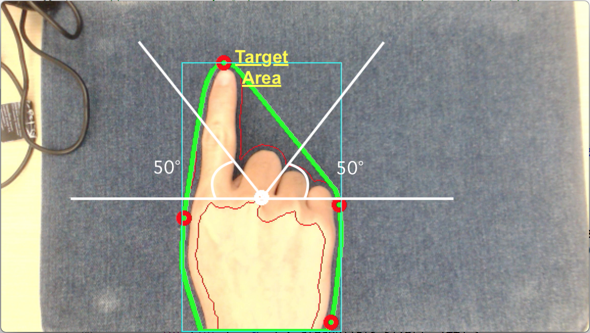
    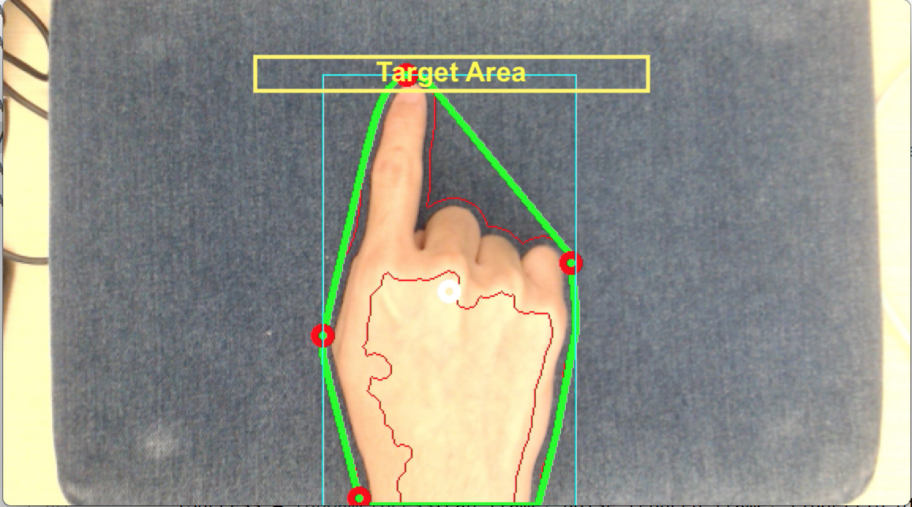

A sample output of this step:

    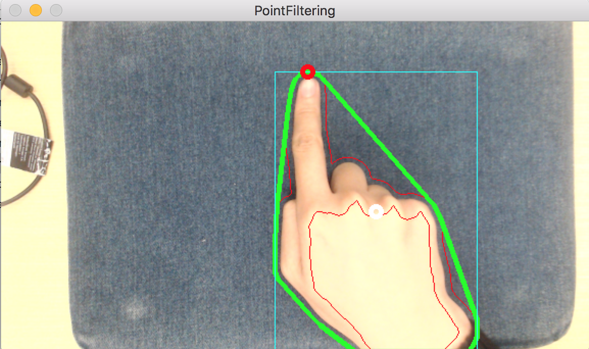

### Back Projection
Back Projection is a way of recording how well the pixels of a given image fit the distribution of pixels in a histogram model. To make it simpler: For Back Projection, you calculate the histogram model of a feature and then use it to find this feature in an image.

This method is given by openCV library, it is very handy to use the ROI histogram information to project back the region relating to the ROI.

    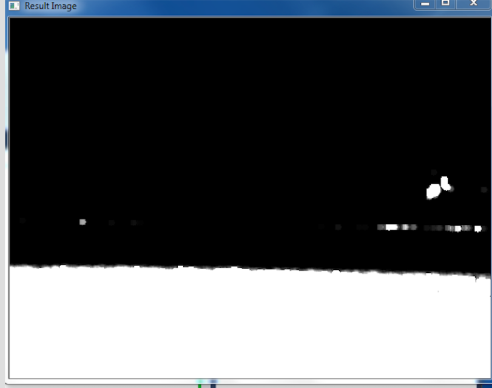

## Experiments and Results
Please see the [this](Demo/Video/) directory for the experiments video.

